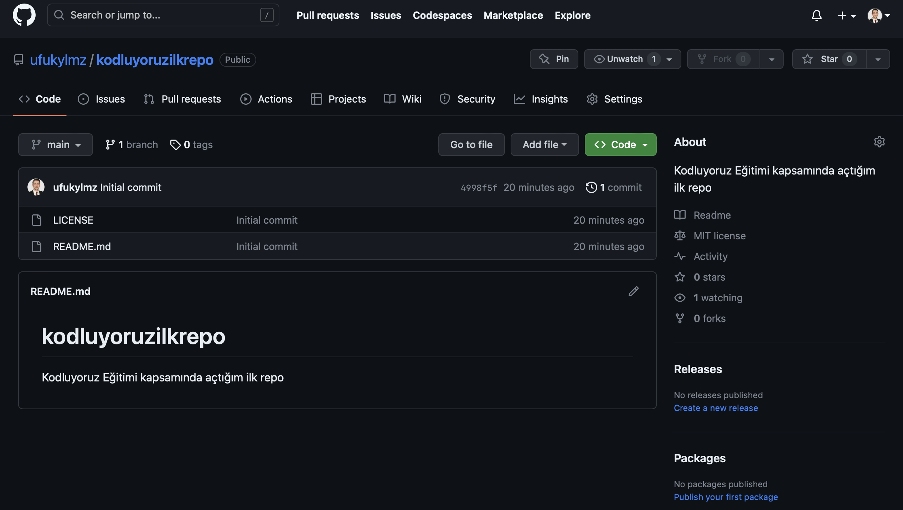

# Kodluyoruz Ilk Repo

Bu repo [Kodluyoruz](https://kodluyoruz.org) Front End Egitiminde olusturdugumuz ilk repo. Içerisinde bir adet
README dosyasi, bir adet de index.html barindiryor.



## Installation

Öncelikle projeyi clonelayin.
```
git clone https://github.com/ufukylmz/kodluyoruzilkrepo.git
```

## Usage

Projeyi cloneladiktan sonra Visual Studio Code programinda açiniz.

```
cd kodluyoruzilkrepo
code .
```

## Contributing

Pull requestler kabul edilir. Büyük degisiklikler için, lütfen önce neyi degistirmek
istediginizi tartismak için bir konu açiniz.

## License

[MIT](https://github.com/ufukylmz/kodluyoruzilkrepo/blob/main/LICENSE)